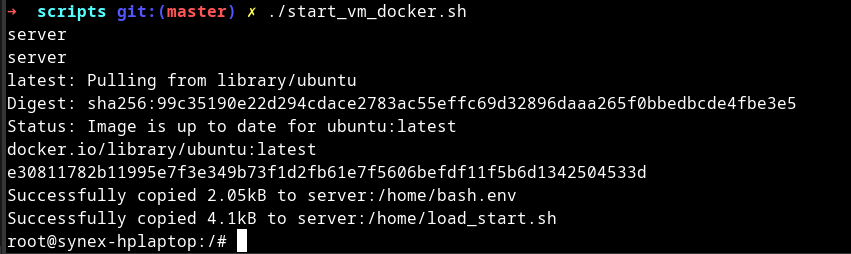
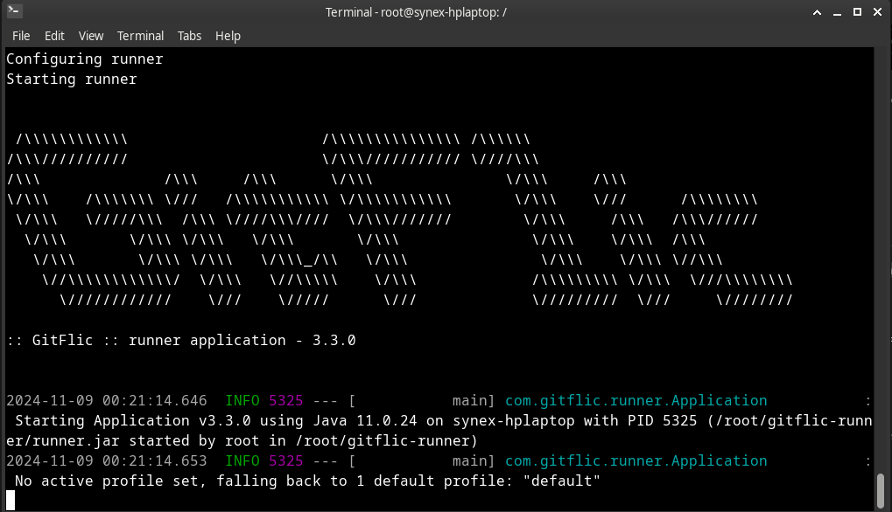
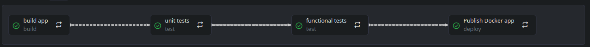

# Практическая работа

Выполнил Маликов Александр
5142704/30801

## Необходимо
Для запуска на машине для агента должен быть установлен docker и быть доступ в интернет.
## Порядок запуска

Находясь в папке scripts, выполнить 
```touch bash.env```, в который записать переменные окружения с кредами и необходимыми ссылками.
```shell
RUNNER_URL='https://gitflic.ru/project/gitflic/runner/release/95280c9d-7011-437c-9577-e9829e78ef6c/d6b0cccc-153a-4cd8-8981-c1a0266b37e2/download'
GITFLIC_AGENT_URL=#GITFLIC_RUNNER_URL
GITFLIC_AGENT_TOKEN=#GITFLIC_TEAM_RUNNER_TOKEN
DOCKER_REGISTRY_LOGIN=
DOCKER_REGISTRY_PASSWD=
```
Далее запустить скрипт `scripts/start_vm_docker.sh`, который создаст контейнер на базе ubuntu. 


В запущенном контейнере необходимо выполнить команду 

```cd /home && ./load_start.sh```

В результате будет сформировано окружение для запуска gitflic-агента и он будет запущен.



## Запуск агента
Запуск агента описан в файле `scripts/load_start.sh`.

Если коротко:
 - Устанавливаются необходимые пакеты
    - python
    - java
    - docker
 - Конфигурируется docker
 - Конфигурируется runner для gitflic-агента
    - Загрузка с github через `wget`
    - Подготовка рабочей директории `$HOME/gitflic-runner`
    - Регистрация runner в gitflic
    - Конфигурация свойств runner
    - Запуск runner

## Модификация проекта
Для того, чтобы проект запустился были внесены следующие изменения:
 - Замена `setup` и `teardown` методов pytest-а на `setup_method` и `teardown_method`
 - Адаптация функциональных тестов под использование удаленного WebDriver с `selenium/standalone-chrome`

## Разработка gitflic-ci.yaml

Конвейер должен включать 3 этапа:
 - Сборка приложения
 - Тесты
 - Выпуск

### Сборка приложения

За сборку приложения отвечает задача `build app` этапа `build`.

Сборка включает в себя создание docker образа из python-приложения на базе образа python:3.8-alpine. Образ является артефактом этой задачи.

Dockerfile приведен ниже

```docker
FROM python:3.8-alpine
ADD ./requirements.txt /app/requirements.txt
WORKDIR /app
RUN pip install -r requirements.txt
COPY . /app
ENTRYPOINT [ "python3" ]
CMD ["app.py"]
```

### Тесты
#### Unit-тесты

В юнит тестах создается `python-venv` с `pytest`-ом и происходит запуск тестов через вызов `pytest` с папкой `tests/unit tests`.

#### Функциональные тесты

В юнит тестах создается `python-venv` с `pytest` и `selenium` и происходит запуск тестов через вызов `pytest` с папкой `tests/functional tests`.

Для запуска тестов в docker запускается 2 контейнера:
 1. Контейнер образа приложеения с этапа `build app`
 2. Контейнер образа `selenium/standalone-chrome`

### Выпуск приложения

Выпуск осуществляется посредствам публикации образа, собранного на этапе `build app` в docker registry.

### Зависимости задач

Задачи выполняются только при условии успешного выполнения предыдущих



## Вывод

По итогу, успех :)

